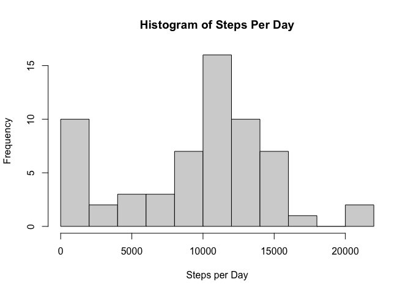
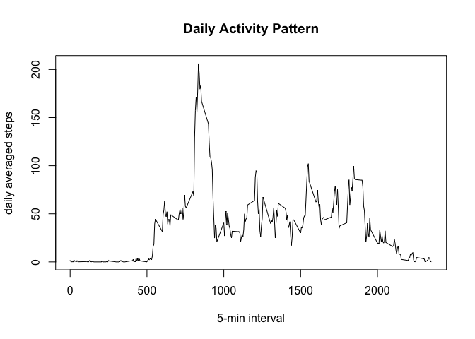
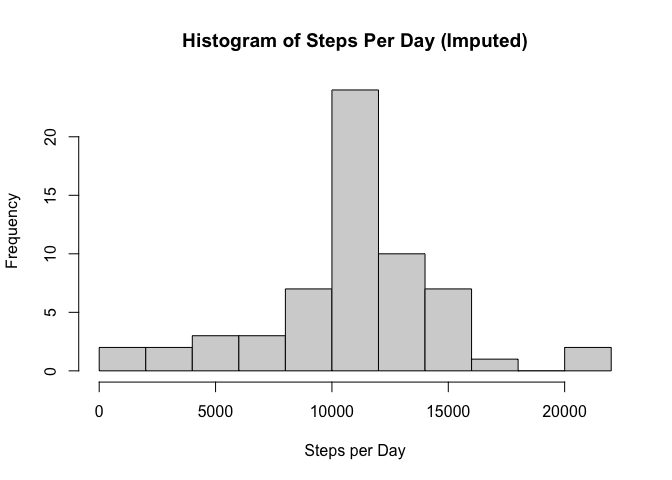
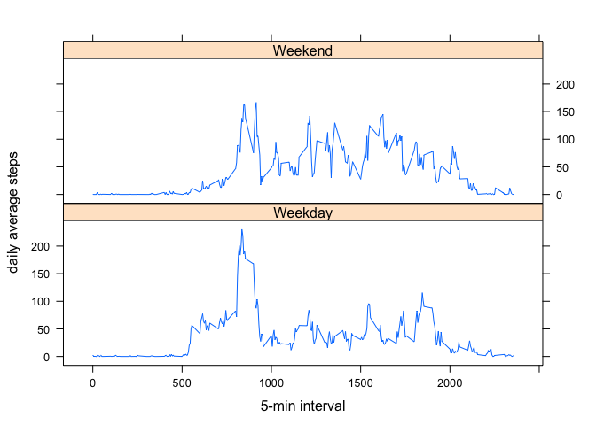

******
### Last Edited: 21 Aug 2020
This is the R markdown document that analyzes the activity monitor data of an unknown individual. This project is a part of the Coursera course *Reproducible Research* assignment.

The data is available for download at [here](https://d396qusza40orc.cloudfront.net/repdata%2Fdata%2Factivity.zip)

The variables in this dataset are:


1. *step*s: Number of steps taking in a 5-minute interval (missing values are coded as NA)
2. *date*: The date on which the measurement was taken in MM/DD/YY format
3. *interval*: Identifier for the 5-minute interval in which measurement was taken


### Loading necessary packages

```r
library(tidyverse)
library(magrittr)
library(lattice)
```

### Loading and preprocessing the data


```r
activity_data <- read.csv(unz("activity.zip","activity.csv"), colClasses = c(date = "Date"))

## step_perday is a vector (61 obs. of 2 var.) describing the date 
## and the total steps for that day
step_perday <- activity_data %>% group_by(date) %>% mutate(
  StepsPerDay = sum(steps, na.rm = T)) %>% ungroup() %>%
  select(date, StepsPerDay) %>% distinct(date, .keep_all = T)
```

### Histogram of steps taken each day 


```r
ifelse(dir.exists("./figure"), NA, dir.create("./figure"))
```

```
## [1] NA
```

```r
hist(step_perday$StepsPerDay, main = "Histogram of Steps Per Day",
     xlab = "Steps per Day", breaks = 10)
```

<!-- -->

```r
dev.copy(png,"./figure/DailySteps_histo.png")
```

```
## quartz_off_screen 
##                 3
```

```r
dev.off()
```

```
## quartz_off_screen 
##                 2
```
### What is mean total number of steps taken per day?


```r
mean_step <- round(mean(step_perday$StepsPerDay), digits = 1)
median_step <- median(step_perday$StepsPerDay)
```

The **mean** total number of steps taken per day is 9354.2


The **median** total number of steps taken per day is 10395

### What is the average daily activity pattern?


```r
## step_average is a vector (288 obs. of 2 var.) describing the interval 
## and the average steps for given interval across all dates
step_average <- activity_data %>% group_by(interval) %>% mutate(
  average_daily = mean(steps, na.rm = T)) %>% ungroup() %>%
  select(interval, average_daily) %>% distinct(interval, .keep_all = T)

with(step_average, plot(interval, average_daily, type = "l",
                        xlab = "5-min interval",
                        ylab = "daily averaged steps",
                        main = "Daily Activity Pattern"))
```

<!-- -->

```r
dev.copy(png, "./figure/DailyActivity.png")
```

```
## quartz_off_screen 
##                 3
```

```r
dev.off()
```

```
## quartz_off_screen 
##                 2
```

```r
max_steps <- round(max(step_average$average_daily), digits = 1)
max_steps_index <- step_average$interval[which.max(step_average$average_daily)]
```

Averaged across all days, the 5-min interval containing the most steps is 835, with 206.2 steps.


### Imputing missing values


```r
totalNA <- sum(is.na(activity_data$steps))
```

There are 2304 missing values in the data. In attempt to impute the missing values, the mean for the 5-min interval *(averaged over all the available days)* will be used in the place of the NA.


```r
activity_data_impute <- activity_data
for (i in 1:length(activity_data_impute$steps)){
  if (is.na(activity_data_impute$steps[i])){
    activity_data_impute$steps[i] <- step_average$average_daily[
      which(step_average$interval == activity_data_impute$interval[i])
    ]
  }
  else{}
}
```


```r
step_perday_impute <- activity_data_impute %>% group_by(date) %>% mutate(
  StepsPerDay = sum(steps, na.rm = T)) %>% ungroup() %>%
  select(date, StepsPerDay) %>% distinct(date, .keep_all = T)

hist(step_perday_impute$StepsPerDay, main = "Histogram of Steps Per Day (Imputed)",
     xlab = "Steps per Day", breaks = 10)
```

<!-- -->

```r
dev.copy(png,"./figure/DailySteps_histo_impute.png")
```

```
## quartz_off_screen 
##                 3
```

```r
dev.off()
```

```
## quartz_off_screen 
##                 2
```

```r
mean_step_impute <- as.integer(mean(step_perday_impute$StepsPerDay))
median_step_impute <- as.integer(median(step_perday_impute$StepsPerDay))
```
For imputed data, the **mean** total number of steps taken per day is 10766


For imputed data, the **median** total number of steps taken per day is 10766


By imputing missing value, the distribution for the average steps per day are more normal, and is no longer left-skewed. Both mean and median of total steps taken per day increased from replacing NA values. For imputed data, mean of the total daily steps taken is the same as median total daily steps taken.

### Are there differences in activity patterns between weekdays and weekends?


```r
wdays <- c("Monday","Tuesday","Wednesday","Thursday","Friday")
wends <- c("Saturday","Sunday")

activity_data_impute_2 <- activity_data_impute %>%
  mutate(DoW = weekdays(date)) %>%
  mutate(wd = factor(DoW,levels = c(wdays,wends),labels = c(rep("Weekday",5), rep("Weekend",2))))

## step_average_2 is a vector (576 obs. of 3 var.) describing the day of week
## (i.e. weekday or weekend), the interval, and the average step for the given
## interval across all days of the weekday (or weekend)

step_average_2 <- activity_data_impute_2 %>% group_by(wd,interval) %>% mutate(
  average_daily = mean(steps, na.rm = T)) %>% ungroup() %>%
  select(interval, average_daily,wd) %>% distinct(interval,wd, .keep_all = T)

xyplot(average_daily ~ interval | wd, data = step_average_2, layout = c(1,2),
       xlab = "5-min interval", ylab = "daily average steps", type = "l")
```

<!-- -->

```r
dev.copy(png, "./figure/DailyActivity_DoW.png")
```

```
## quartz_off_screen 
##                 3
```

```r
dev.off()
```

```
## quartz_off_screen 
##                 2
```
It appears the max average steps traveled per interval on hte weekend is **smaller** than that of weekday. Furthermore, the individual tracked appears to be slightly more active from 10 AM to midnight on weekends than weekdays. 

